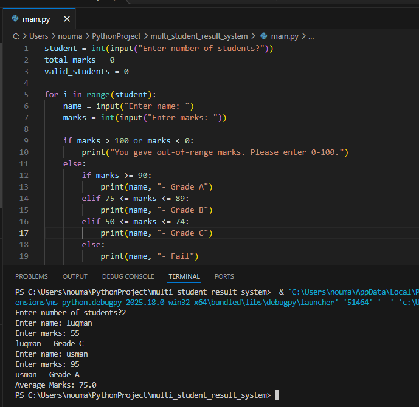
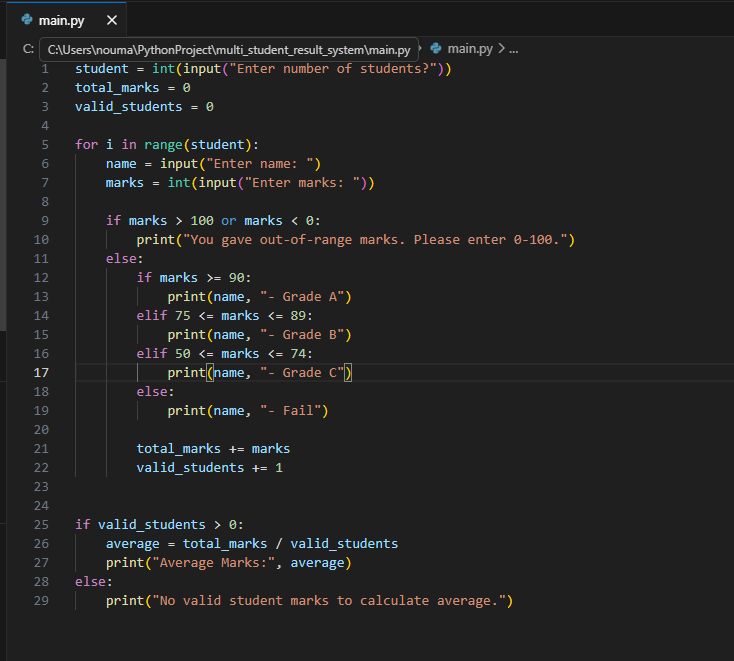

# 🎓 Multi-Student Result System

A beginner Python project that calculates grades for multiple students and computes the average marks using loops and conditional logic.  

---

## 🛠️ Features
- Handles multiple students automatically  
- Takes input for student name and marks  
- Validates marks (0–100)  
- Calculates grade: A, B, C, Fail  
- Calculates average marks of all valid students  

---

## 💡 What I Learned
- Using `for` loops for repeated tasks  
- Using `if-elif-else` for conditions  
- Input validation  
- Keeping track of totals and counts  
- Structuring code for multiple inputs  

---

## ▶️ How It Works
1. User enters **number of students**  
2. Program loops for each student:
    - Takes **name** and **marks**  
    - Validates marks (0–100)  
    - Assigns **grade**  
    - Adds marks to total if valid  
3. Calculates and prints **average marks**  

---

## 📸 Sample Output

---

## 💻 Code Preview

